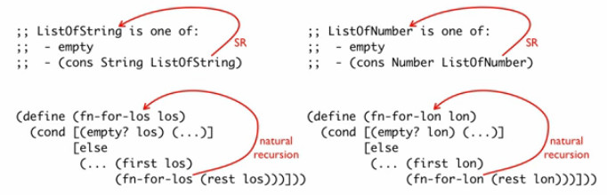

= 4a - Self-Reference - How to Code — Systematic Program Design — EDX Online Course
:source-highlighter: pygments
:pygments-css: class
:toc: left
:toc-title: Index
:idprefix:
:toclevels: 6
:sectlinks:
:webfonts!:
:icons: font
:figure-caption!:

== Food for Thought

Time is a constant. It passes by. Just. If you are working or studying and constantly checking social media news feed, irc, etc., you are taking much more time to complete the task at hand and wasting time (= life) for no good reason. When you are doing something, *do that*. Remember that saying: “Wherever you are, be there!”

== 4a: Self Reference

=== Intro to Arbitrary Sized Data

No more fixed number of items/elements/data to deal with. We'll learn how to deal with information that we don't know upfront how many of it there will be!

=== List Mechanisms

One can represent arbitrarily-sized data using compound data. This approach will be learned later.

The simplest way to work with and represent arbitrarily-sized data is using *lists of values*.

`empty` is an empty list of any type of data. It is just a name for `'()`, that is, `empty` and `'()` are the same thing.

You `cons` things onto an empty list to create longer and longer lists. `cons` is a two-argument constructor.

We can use expressions to produce a value for an element of a list, but the resulting list values are formed out of values only, no other expressions.

[source,racket]
----
(cons (string-append "Obi" "wan" empty))
;; produces:
(cons "Obiwan" empty)
----

`first` and `rest` are akin to `car` and `cdr` in some other lisps.

To check whether a list is empty you use `empty?`.

==== Questions

'''

===== Q 1

[role='question']
--
What is the value produced by the expression below?

----
(cons (+ 1 1) (cons 1 empty))
----

----
a: 3
b: 2
c: (cons 3 empty)
d: (cons 2 (cons 1 empty))
----
--

[role='answer']
--
A: Letter _d_ is correct.
--

'''

===== Q 2

[role='question']
--

----
(define L1 (cons "Systematic"
                 (cons "Program"
                       (cons "Design" empty))))
(define L2 (cons 1 empty))
----

What is the value produced by the expression `(first L1)`?

----
a: (cons "Systematic Program Design" empty)
b: (cons "Program" (cons "Design" empty))
c: (cons "Systematic" empty)
d: "Systematic"
e: "Design"
f: empty
----
--

[role='answer']
--
A: Letter _c_ is correct. “Systematic” is the value produced by `(first L1)`.
--

'''

===== Q 3

[role='question']
--
What is the value produced by the expression `(rest L1)` from the previous exercise?

----
a: (cons "Systematic Program Design" empty)
b: (cons "Program" (cons "Design" empty))
c: (cons "Systematic" empty)
d: "Systematic"
e: "Design"
f: empty
----
--

[role='answer']
--
The rest of the list

----
(cons "Systematic" (cons "Program" (cons "Design" empty)))
----

is the list

----
(cons "Program" (cons "Design" empty))
----

Therefore, letter _b_ is correct.
--

'''

===== Q 4

[role='question']
--
What is the value produced by the expression `(empty? L2)`?

----
(cons 1 empty)
empty
true
false
----
--

[role='answer']
--
`false` produced by the expression `(empty? L2)`?
--

'''

===== Q 5

[role='question']
--
What is the value produced by the expression `(empty? (rest L2))`?

----
(cons 1 empty)
empty
true
false
----
--

[role='answer']
--
It produces `#true`.
--

'''

===== Q 6

[role='question']
--
How many elements does this list have?

----
(cons "a" (cons (string-append "b" "c") (cons "d" empty)))
2
3
4
5
----
--

[role='answer']
--
It has 3 element.s
--

'''

=== List Data Definition

.Self-reference type comment

The position where the arrow starts and ends is important for quizzes later.

Always make sure the examples match the type definition.

[source,racket]
----
(define LOS1 empty)
(define LOS2 (cons "jedi" empty))
(define LOS3 (cons "jedi" (cons "tux" empty)))
(define LOS4 "obiwan" "anakin")
----

The last one doesn't match the type comment, it never cons onto `ListOfString`.

The self-reference lets us match arbitrarily long lists.

We must represent information about the world as data in the program, but we must also know how to interpret data in the program as the information about the world.

==== vd - Quidditch Teams - Part 1

[source,racket,lineos]
----
include::part04a/vd01-quidditch.e.rkt[]
----

If we have the type definition:

----
;; ListOfString is one of:
;; - empty
;; - (cons String ListOfString)
----

And the list:

----
(cons "linux" (cons "vim" (cons "emacs" empty)))
----

We can say that we have a ListOfString with three elements, and the rest of that list is another ListOfString (with two elements), and the rest of that is yet another ListOfString (with one element), and the rest of it is an empty ListOfString. Look:

----
> (define MYLIST (cons "linux" (cons "vim" (cons "emacs" '()))))
> MYLIST
(cons "linux" (cons "vim" (cons "emacs" '())))
> (rest MYLIST)
(cons "vim" (cons "emacs" '()))
> (rest (rest MYLIST))
(cons "emacs" '())
> (rest (rest (rest MYLIST)))
'()
----

Always make sure the examples match the type difinition: Is LOS1 a ListOfString? Is LOS2 a ListOfString? What about LOS3?

'''

==== Exercises

===== Q 1

[role='question']
--
Consider the following Data Definition:

----
;; ListOfNatural is one of:
;; - empty
;; - (cons Natural ListOfNatural)
----

Is empty a ListOfNatural? In other words, does empty match the type ListOfNatural?
--

[role='answer']
--
Yes, it is.
--

'''

===== Q 2

[role='question']
--
Is `(cons 1 (cons 1.5 '())` a ListOfNatural?
--

[role='answer']
--
No, it isn't.

First we look at the case `(cons Natural ListOfNatural)` and ask is 1 Natural? The answer is yes. Then we ask if `(cons 1.5 empty)` is ListOfNatural. This requires 1.5 to be Natural, which it is not, so `(cons 1 (cons 1.5 empty)` is not a ListOfNatural.
--

'''

===== Q 3

[role='question']
--
Consider the following partial data definition:

----
;; Mystery is one of:
;; - (cons 1 empty)
;; - (cons Natural Mystery)
----

Which of the following match the type Mystery?

----
a: (cons 2 empty)
b: (cons 1 empty)
c: (cons 5 (cons 4 (cons 1 empty)))
d: empty
----
--

[role='answer']
--
Options _b_ and _c_ match the type Mistery.

For the first option, 2 is of type Natural, but empty is not a Mystery, so it does not match.

The second option is exactly `(cons 1 empty)`.

In the third option, 5 is of type Natural, so we need to check if `(cons 4 (cons 1 empty))` is a mystery. Next, we see that 4 is Natural, so we need `(cons 1 empty)` to be a Mystery, which it is.

In the fourth case, empty is neither `(cons 1 empty)` nor `(cons Natural Mystery)`.
--

'''

=== Functions Operating on List

.Template for ListOfString from previous lesson

----
;; Template Rules Used:
;;  - one of: 2 cases
;;    - atomic distinct: empty
;;    - compound: (cons String ListOfString)
;;    - <What else here? Coming son!>
----

==== vd - Quidditch Teams - Part 2

[source,racket,lineos]
----
include::part04a/vd02-quidditch.e.rkt[]
----

In this example we used a recursive call to `contains-ubc?`, and that was naturally caused by the self-reference in the type comment.

'''

==== Questions

Consider the following Date Definition for ListOfNumber:

----
;; ListOfNumber is one of:
;; - '()
;; - (cons Number ListOfNumber)
;; Interp. a list of numbers.
(define LON1 '())
(define LON2 (cons 1 '()))
(define LON3 (cons 2 (cons 1 '())))

#;
(define (fn-for-lon lon)
  (cond [(empty? lon) (...)]
        [else
         (... (first lon)
              (fn-for-lon (rest lon)))]))

;; Template Rules Used:
;; - one of: 2 cases
;;   - atomic distinct: empty
;;   - compound: (cons Number ListOfNumber)
;; - <the one we are yet to study>
----

And this signature and purpose:

----
;; ListOfNumber -> Boolean
;; Produce #true if a lon contains a negative number.
----

===== Q 1, 2, and 3

[role='question']
--
What is the result of the following tests?

----
(check-expect (contains-negative? (cons 1 empty)) _____)
(check-expect (contains-negative? (cons 1 (cons -1.5 empty))) _____)
(check-expect (contains-negative? empty) _____)
----
--

[role='answer']
--
`#false`, `#true` and `#false`.
--

'''

===== Q 4, 5 and 6

Based on

----
;; ListOfNumber -> Boolean
;; Produce #true if a lon contains a negative number.
(check-expect (contains-negative? (cons 1 empty)) _____)
(check-expect (contains-negative? (cons 1 (cons -1.5 empty))) _____)
(check-expect (contains-negative? empty) _____)
----

Let's fill the blanks for:

----
(define (fn-for-lon lon)
  (cond [(empty? lon) __1__]
        [else
          if (__2__(first lon))
             #true
             (__3__(fn-for-lon (rest long)))]))
----

[role='question']
--
Q4: What goes on \___1___, `emtpy`, `#true` or `#false`?
--

[role='answer']
--
A: `#false` goes on \___1___.
--

[role='question']
--
Q5: What should we use to check if the first element of lon is negative in \___2___?
--

[role='answer']
--
A: We should use `negative?`.
--

[role='question']
--
Q6: In \___3___, what function should we use in place of `fn-for-lon`?
--

[role='answer']
--
A: In \___3___ we should use `contains-negative?`.
--

'''

=== Revising Recipes for Lists

Remember: arbitrary amounts of things require arbitrarily-sized data.

The _self-reference case_ is what allows data to become longer and longer. The _base case_, though, is what allows it to end, eventually (indispensable for recursion).

Well-formed self-reference:

- at least one base case (allows it to stop, end, finish);
- at least one self-reference case (allows it to grow arbitrarily).

Examples must include both base case and self-reference cases.

The self-reference template rule puts a natural recursion in the template that corresponds to the self-reference in the type comment.

.Template with natural recursion

The self-reference is what is known as *natural recursion*.

`check-expect` the base case first, then proceed to the other tests.

Use `check-expects` as examples, run tests against the stub, and _only then_ code the final function.

Non-base cases tend to rely on the base cases.

Have one or more tests in which the list is at least two elements long, as it may uncover bugs that would otherwise remain hidden until your program goes into production.

Trust the natural recursion.

==== vd - quidditch - final

[source,racket,linos]
----
include::part04a/vd03-quidditch.e.rkt[]
----

==== Questions

'''

===== Q 1

[role='question']
--
Q: Does the type comment have a self-reference?

----
;; ListOfNumber is one of:
;; - (cons Number ListOfNumber)
----
--

[role='answer']
--
A: Yes, it does.
--

'''

===== Q 2

[role='question']
--
Q: Is this self-referential type comment well-formed?

----
;; ListOfNumber is one of:
;; - (cons Number ListOfNumber)
----
--

[role='answer']
--
A: No, it is not because it lacks a base case.
--

'''

OBS: The previous two questions have the same type comment. But ask different questions about it. It may catch you off guard. Remember that a well-formed self-referential type must have at least one base case and at least on self-reference.

'''

===== Q 3

[role='question']
--
Is this well-formed self-referential type?

----
;; NonEmptyListOfNumber is one of:
;; - (cons Number empty)
;; - (cons Number NonEmptyListOfNumber)
----
--

[role='answer']
--
Yes, it is. This type comment is for a _non-empty_ list, but it is indeed well-formed.
--

'''

===== Q 4

[role='question']
--
In the `contains-negative?` function you designed in an earlier question, which of these check-expects should appear first?

----
a: (check-expect (contains-negative? (cons 1 empty)) false)
b: (check-expect (contains-negative? empty) false)
c: (check-expect (contains-negative? (cons 1 (cons -1.5 empty))) true)
d: It doesn't matter which one appears first 
----
--

[role='answer']
--
A: Letter _b_ is correct. The base case test should always appear first for self-referential functions because it's the simplest and all the other tests depened on it being correct.
--

'''

=== Designing With Lists

==== vd - owls

[source,racket,lineos]
----
include::part04a/vd04-owls.e.rtk[]
----

“all weights of all the owls” → arbitrary number of owl weights → well-formed self-referential data definition.

If the type definition is “ListOfSomething is *one of*”, that “one of” means our template rules should have a “one of: N cases”.

If the comment type definition has a self-reference, the template and the resulting actual functions must also have a self-reference (natural recursion). And we shall never forget the base case.

When copying and renaming the template, also rename the natural recursion.

Again: trust the natural recursion.

'''

==== Questions

===== Q 1

[role='question']
--

----
;; ListOfString is one of:
;; - empty
;; (cons String ListOfString)
(define LOS1 empty)
(define LOS2 (cons "a" empty))
(define LOS3 (cons "a" (cons "b" empty)))
#;
(define (fn-for-los los)
  (cond [(empty? los) empty]
        [else
          (... (first los)
               (rest los))]))
----

In the above Data Definition, what is wrong with the template? Choose all answers that apply.

----
a: It's missing the natural recursion for (first los)
b: It's missing the natural recursion for (rest los)
c: It's missing the base case
d: It's incorrectly named
e: The base case should be (...) instead of empty 
----

--

[role='answer']
--
A: Letters _b_ and _e_ are the options that denote incorrect parts of the template.
--

'''

===== Q 2

[role='question']
--
Which of the following shows the correct self-reference arrow(s)?

--

[role='answer']
--
The correct way is the last one.

The self-reference arrow should originate from the type reference, in this case ListOfNumber in (cons Number ListOfNumber), and should point to the type name ListOfNumber.
--

'''

===== Q 3

[role='question']
--
Your friend is asking you for some feedback on the design of their function `contains-negative?`.

[source,racket,lineos]
----
;; ListOfNumber -> Boolean
;; Produce #true if lon contains a negative number.
(check-expect (contains-negative? '()) #false)
(check-expect (contains-negative? (cons 1 '())) #false)
(check-expect (contains-negative? (cons -1 '())) #true)

(define (contains-negative? lon)
  (cond [(empty? lon) #false]
        [else
         (if (negative? (first lon))
             #true
             #false)]))
----

Which of the following suggestions should you give? Choose all that apply.

----
a: Add a test at least two elements long
b: Don't change anything because all tests pass
c: Add the natural recursion as the false answer expression of the if
d: Whatever you do, don't trust the natural recursion! 
----
--

[role='answer']
--
Letter _a_ and _d_ are correct.
--

'''

===== Q 4, 5 6

[role='question']
--
Explain which part of the template results from which part of the type comment.

--

[role='answer']
--
First of all, ListOfNumber has two cases, so we need a `cond` expression.

This depicts which part of the function results from which part of the template.

--

'''

=== Position in List Templates

Self-references in the type comments lead to natural recursion in the templates.

Consider what we did to the template in `sum`, `count` and `contains-ubc?`. Pay attention to what was done to the base, contribution of the first and combination parts.

'''

==== Questions

===== Q 1, 2 and 3

Consider a function called `product` that multiplies numbers in a list.

[role='question']
--
Q1: What should the base case be?

----
0
1
empty
#false
----
--

[role='answer']
--
A: The base case for the `product` function should be `1`.
--

[role='question']
--
Q2: What is the contribution of the first element?

----
0
1
itself
----
--

[role='answer']
--
A: The contribution of the first element is _itself_.
--

[role='question']
--
Q3: What operation should we use to combine the contribution of the first with the result of the natural recursion?

----
+
*
if
product
----
--

[role='answer']
--
We should use `*` to combine the contribution of the first element with the result of the natural recursion.
--

===== qa - product

Implemented from the questions.

[source,racket,lineos]
----
include::part04a/qa02-product.e.rkt[]
----

'''

=== Practice Problems

==== pp - double all

[source,racket,lineos]
----
include::part04a/pp01-double-all.e.rkt[]
----

'''

==== pp - bool list all true?

[source,racket,lineos]
----
include::part04a/pp02-boollist.e.rtk[]
----

'''

==== pp - largest number

[source,racket,lineos]
----
include::part04a/pp03-largestnum.e.rkt[]
----

'''

==== pp - area of images

[source,racket,lineos]
----
include::part04a/pp04-area-imgs.e.rkt[]
----

'''

==== Gotcha

[role='question']
--
`lon` is a list of numbers.

----
(define (foo  lon)
  (cond [(empty? lon) 1]
        [else
         (* (first lon)
            (bar (rest lon)))]))

(define (bar lon)
  (cond [(empty? lon) '()]
        [else
         (cons (* (first lon) 2)
               (bar (rest lon)))]))
----

Explain what the functions `foo` and `bar` do?
--

[role='answer']
--
`foo` sums all of the elements in lon and return the result as a single number. `bar` doubles each element in `lon` and returns a new list of numbers with the doubled values.
--

'''
'''

=== Quiz (the hard one)

.Question about self-reference well-formedness

NOTE: The base case is something that is either `'()` (meaning an empty list also matches the given type comment) or `(cons SomeType empty)` meaning the list is non-empty, that is, SomeType must appear at least once and `empty` is not a valid thing for that particular case.

'''

image::part04a/imgs/qa02-listABC-typecmt.png[List A, B, C + Type Comments]

Note that:

- ListA: empty or one of two distinct values of “yes” or “no”.
- ListB: empty or a normal list.
- ListC: the only non-empty list in these examples.

Explanation:

- ListA matches template 2 because it is the only one with three cases.
- ListC matches template 1 because it is a non-empty list, and the first cond question in template two is (empty? (rest l)) instead of the usual (empty? l).
- This leaves ListB matching template 3, the standard list template.

'''

----
;; ListA is one of:
;; - empty
;; - (cons "yes" ListA)
;; - (cons "no"  ListA)
;; Interp. ???
----

So, this template means that we can have either an empty list, or a list containing “yes” and “no” and nothing else, it seems. Therefore, this template makes sense for ListA:

----
;; Template 2
(define (fn-for-listA l)
  (cond [(empty? l) (...)]
        [(<some function>) (... (first l)
                           (fn-for-listA (rest l)))]
        [else
         (... (first l)
              (fn-for-listA (rest l)))]))
----

It would check if the list is empty, or if `(first l)` is equal to the string “yes”, otherwise it must be “no” (or something like that.

'''

This is the non-empty list that uses (empty? (rest l)) instead of the usual (empty? l).

----
;; ListC is one of:
;; - (cons String empty)
;; - (cons String ListC)
;; Interp. ???

;; Template 1
(define (fn-for-listX l)
  (cond [(empty? (rest l)) (...)]
        [else
         (... (first l)
              (fn-for-listX (rest l)))]))
----

Note `[(empty? (rest l)) (...)]` instead of the usual `[(empty? l) (...)]`. This is the difference.

'''

The normal, usual data def and template.

----
;; ListB is one of:
;; - empty
;; - (cons String ListB)
;; Interp. ???

;; Template 3
(define (fn-for-listX l)
  (cond [(empty? l) (...)]
        [else
         (... (first l)
              (fn-for-listX (rest l)))]))
----

'''

There are two self-references to Path and both must be specified explicitly.

'''

++++

++++

++++

++++

