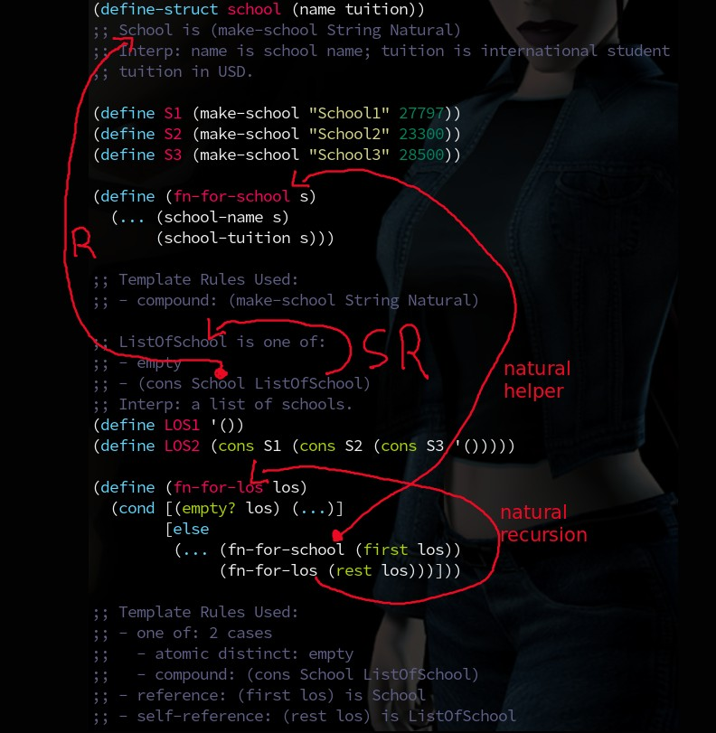
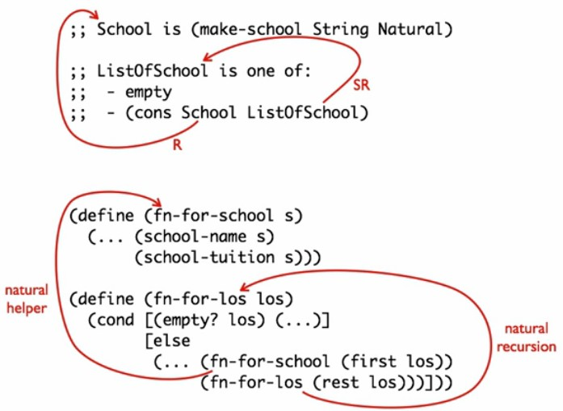

= 4b - Reference - How to Code — Systematic Program Design — EDX Online Course
:source-highlighter: pygments
:pygments-css: class
:toc: left
:toc-title: Index
:idprefix:
:toclevels: 6
:sectlinks:
:webfonts!:
:icons: font
:figure-caption!:

== Food for Thought

Time is a constant. It passes by. Just. If you are working or studying and constantly checking social media news feed, irc, etc., you are taking much more time to complete the task at hand and wasting time (= life) for no good reason. When you are doing something, *do that*. Remember that saying: “Wherever you are, be there!”

== 4b: Reference

Learning for this module:

Be able to predict and identify the correspondence between references in a data definition and helper function calls in functions that operate on the data.

'''

=== The Reference Rule Part 1

We are going to use two data definitions in this problem, and one data definition is going to refer to the other data definition.

So, there will be a reference relationship in the type comment, a natural helper in the templates, and a helper function call in the final function.

So, in this example, besides ListOfSchool self-reference, we also have ListOfSchool referencing School, which is a non-primitive data type, that is, a type we created ourselves.

Also, we use a natural helper, `fn-for-chool` in `fn-for-los`.

If `(first somelist)` is a non-primitive type, the template for `somelist`  must add a natural helper. E.g. if `(first los)` is `Student`, we need to use `fn-for-student`, the natural helper.

And in the “template rules used” we then have a line similar to:

----
- reference: (first los) is School
----

// TODO
//[source,racket,lineos]
//----
//include::part04b/vd01-tuition-graph.e.rkt[]
//----

Pay attention to what happens:

And this is the video's example:

'''

=== The Reference Rule Part 2

++++

++++

++++

++++

